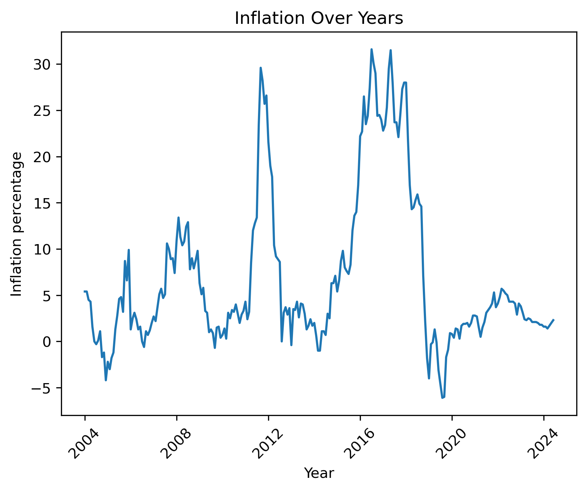
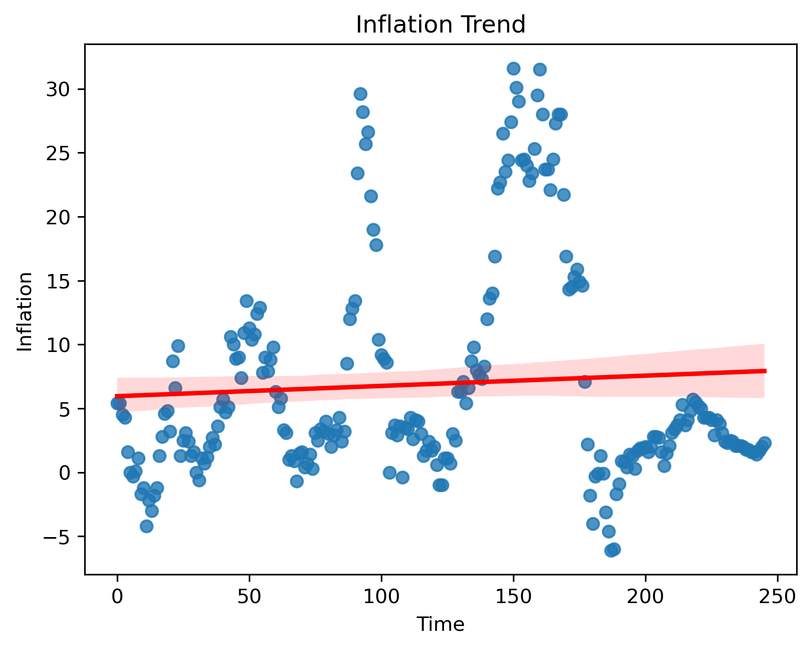
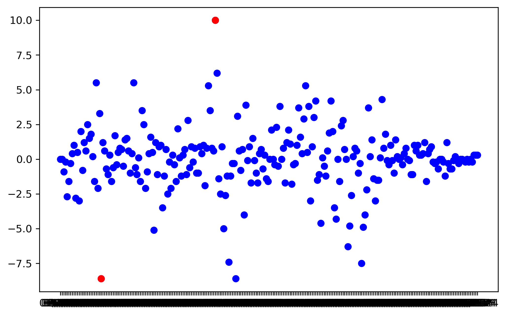

# 📊 Libya Inflation Analysis (2004 - 2024)


## 📌 Project Overview

This project analyzes inflation rates in Libya from 2004 to 2024 using Python and data analysis techniques.

The dataset represents inflation rates (percentage changes in price levels over time), not actual prices.

The main goal is to explore trends, detect patterns, identify outliers, and provide simple forecasting.

---

## 🛠️ Tools & Libraries

- Python 🐍  
- Pandas  
- NumPy  
- Matplotlib  
- Seaborn  
- Jupyter Notebook  

---

## 📂 Project Files

- `main.ipynb` → Full analysis notebook  
- `main.html` → Exported report version  
- `LY_Inflation.csv` → Dataset used  
- `README.md` → Project documentation  
- `images/` → Visualizations used in the report  

---

## 📊 Data Preparation

- Merging `Year` and `Month` into a single `Date` column  
- Converting date into proper datetime format  
- Sorting data chronologically  
- Saving cleaned dataset for reuse  

---

## 📈 Inflation Trend Over Time

The following chart shows inflation behavior over the studied period:



📌 The trend shows fluctuations with a slightly upward long-term direction.

---

## 📉 Monthly Changes Analysis

This section highlights month-to-month changes in inflation rates:



📌 It helps identify sudden increases and decreases in inflation.

---

## 🚨 Outlier Detection

Extreme inflation values (above normal behavior) were identified:



📌 These points represent unusual economic conditions.

---

## 📊 Key Insights

- Inflation shows strong fluctuations over time  
- Overall trend is slightly increasing  
- Some months show consistent higher inflation  
- Outliers indicate economic instability periods  
- Short-term forecasting is possible using recent data  

---

## 🔮 Simple Forecasting

A basic prediction method was applied using the average of the last 3 months.

📌 This gives an approximate short-term estimate of inflation behavior.

---

## 🚀 How to Run This Project

```bash id="g1k9aa"
git clone https://github.com/USERNAME/REPO_NAME.git
cd REPO_NAME
jupyter notebook
